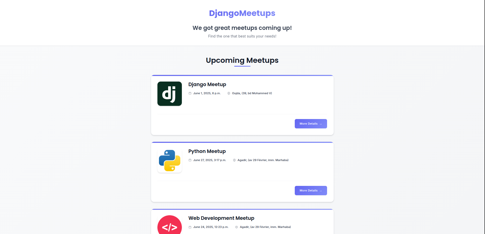
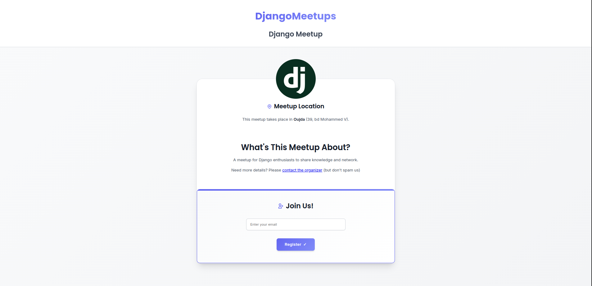
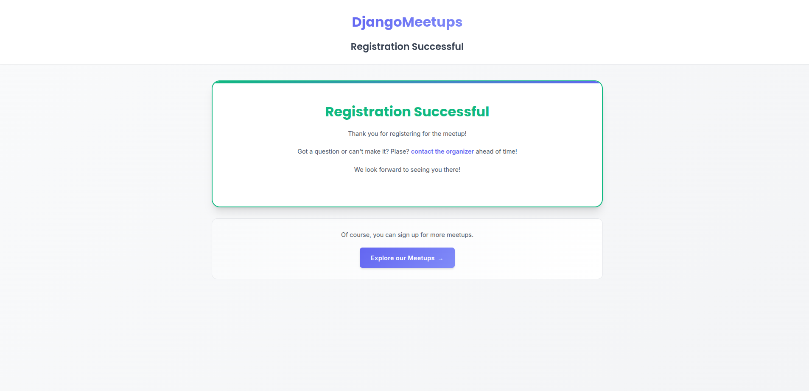

# DjangoMeetups 🐍

A Django web application for organizing and managing developer meetups. Browse events, register with your email, and connect with the developer community.


## 📸 Screenshots

### Homepage - Meetup Listings


### Meetup Detail Page


### Registration Success


## 🚀 Key Django Features Used

### 📊 Models & Database
- **Custom Models**: `Meetup`, `Location`, `Participant`
- **Relationships**: Foreign Key (Meetup → Location), Many-to-Many (Meetup ↔ Participant)
- **Field Types**: CharField, TextField, EmailField, DateTimeField, SlugField, ImageField
- **Migrations**: Database schema management with 4 migration files

```python
class Meetup(models.Model):
    title = models.CharField(max_length=200)
    organizer_email = models.EmailField()
    location = models.ForeignKey(Location, on_delete=models.CASCADE)
    date = models.DateTimeField()
    slug = models.SlugField(unique=True)
    image = models.ImageField(upload_to='images')
    Participant = models.ManyToManyField(Participant, blank=True, null=True)
```

### 🎯 Views & URLs
- **Function-Based Views**: Index, detail, and registration views
- **URL Routing**: Slug-based URLs with named patterns
- **Form Processing**: GET/POST handling with CSRF protection

```python
urlpatterns = [
    path('', views.index, name='meetups_index'),
    path('<slug:meetup_slug>/', views.meetup_detail, name='meetup_detail'),
    path('<slug:meetup_slug>/success/', views.confirm_registration, name='registration_success'),
]
```

### 📝 Forms & Templates
- **Custom Forms**: Email registration form with validation
- **Template Inheritance**: Base template with reusable blocks
- **Template Features**: Static files, template tags, conditional rendering

```python
class RegistrationForm(forms.Form):
    email = forms.EmailField(
        label='',
        widget=forms.EmailInput(attrs={'placeholder': 'Enter your email'})
    )
```

### 👑 Admin Interface
- **Custom Admin**: Enhanced admin with list display, filtering, and prepopulated slugs
- **Model Registration**: All models accessible through Django admin

```python
class MeetupAdmin(admin.ModelAdmin):
    list_display = ('title', 'date', 'location', 'slug')
    list_filter = ('location', 'date')
    prepopulated_fields = {'slug': ('title',)}
```

## 🛠️ Quick Setup

1. **Install dependencies**
   ```bash
   pip install django pillow
   ```

2. **Run migrations**
   ```bash
   cd mysite
   python manage.py migrate
   ```

3. **Start server**
   ```bash
   python manage.py runserver
   ```

4. **Visit**: http://127.0.0.1:8000/meetups/

## ✨ Core Features

- **Browse Meetups**: Card-based listing of all events
- **Event Details**: Comprehensive meetup information with registration
- **Email Registration**: Simple registration system
- **Admin Management**: Full CRUD operations through Django admin
- **Responsive Design**: Mobile-friendly interface
- **Image Uploads**: Event photos with proper media handling

## 📦 Project Structure

```
mysite/
├── meetups/
│   ├── models.py          # Database models
│   ├── views.py           # View functions
│   ├── forms.py           # Registration form
│   ├── admin.py           # Admin configuration
│   ├── migrations/        # Database migrations
│   └── templates/         # HTML templates
└── static/meetups/        # CSS and images
```

---

**Built with Django for the developer community** 🚀